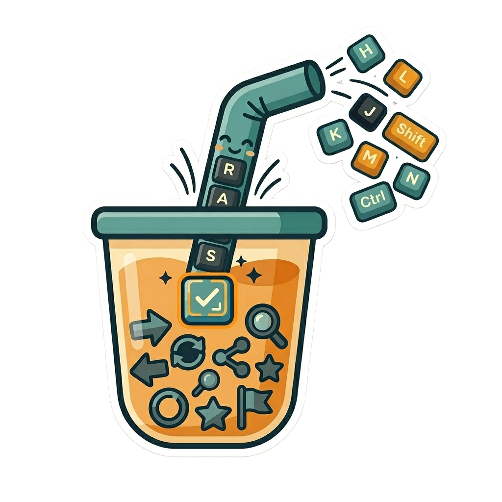

<p align="center">
  
</p>

---

# straw

Reusable key sequence resolver for Bubble Tea applications with modifier-aware matching.

Bubble Tea emits individual key press messages. `straw` turns those events into higher-level key sequence results such as pending prefix, matched binding, unmatched input, and canceled sequence.

## Installation

```sh
go get github.com/kozikowskik/straw
```

Bubble Tea v2 users should import the v2 adapter:

```go
import straw "github.com/kozikowskik/straw/bubbletea/v2"
```

Bubble Tea v1 users should import the v1 adapter:

```go
import straw "github.com/kozikowskik/straw/bubbletea/v1"
```

The root `github.com/kozikowskik/straw` package contains the version-neutral resolver core for advanced use and adapter authors. If you need both packages in one file, import the root package as `strawcore`.

## Quick Start

Define application-owned actions, bind them to key sequences, and call the resolver from your Bubble Tea `Update` function.

```go
package main

import (
	"fmt"

	tea "charm.land/bubbletea/v2"
	straw "github.com/kozikowskik/straw/bubbletea/v2"
)

type action string

const (
	goHome action = "go-home"
	goDashboard action = "go-dashboard"
)

type model struct {
	resolver *straw.Resolver[action]
}

func newModel() (model, error) {
	resolver, err := straw.New([]straw.Binding[action]{
		straw.Bind(goHome, straw.TextSequence("gh"), straw.Description("go home action")),
		straw.Bind(goDashboard, straw.TextSequence("gd"), straw.Description("go dashboard action")),
	})
	if err != nil {
		return model{}, err
	}
	return model{resolver: resolver}, nil
}

func (m model) Update(msg tea.Msg) (tea.Model, tea.Cmd) {
	result, cmd := m.resolver.Update(msg)

	switch {
	case result.Match(goHome):
		fmt.Println("go home action")
		return m, cmd
	case result.Match(goDashboard):
		fmt.Println("go dashboard action")
		return m, cmd
	}

	// Only unmatched pass-through keys should reach the host key switch.
	// Pending prefixes and matched-but-unhandled bindings stay consumed by straw.
	if !straw.ShouldPassThrough(result) {
		return m, cmd
	}

	switch msg := msg.(type) {
	case tea.KeyPressMsg:
		switch msg.String() {
		case "ctrl+c", "q":
			return m, tea.Quit
		}
	}

	return m, cmd
}
```

The resolver only reports key sequence outcomes. Your application owns the actions and decides which Bubble Tea commands to return.

## Examples

Runnable examples are available in the `examples/` directory:

```sh
go run ./examples/bubbletea-v2
go run ./examples/bubbletea-v1
go run ./examples/timeout-cancel
```

## Features

- Resolve multi-key sequences such as `gh` and `gd`.
- Match modified keys such as `ctrl+c` and `alt+enter`.
- Handle ambiguous prefixes with pending timeouts.
- Keep unmatched keys available for normal Bubble Tea key handling.
- Use Bubble Tea v1 or v2 through separate adapter packages.

## Documentation

- [Core concepts](docs/concepts.md): resolver states, sequence matching, timeouts, cancellation, and pass-through behavior.
- [Bindings](docs/bindings.md): text keys, special keys, modified keys, sequences, and binding metadata.
- [Bubble Tea integration](docs/bubble-tea.md): adapter imports, update-loop patterns, nested models, and v1/v2 differences.
- [Troubleshooting](docs/troubleshooting.md): common integration issues and how to diagnose them.

## Status

`straw` is pre-v1 software. The API is intended for early use, but may change before v1 based on real Bubble Tea integrations.

## Contributing

Contributions are welcome. See `CONTRIBUTING.md` for local setup, tests, benchmarks, and pull request expectations.

## License

`straw` is available under the MIT License. See `LICENSE` for details.
